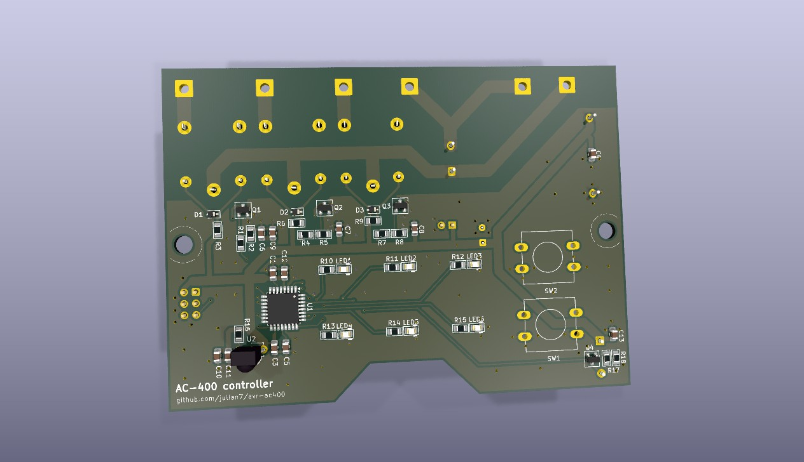

# Record Power AC400 controller

This repository contains a drop-in replacement PCB and firmware for the Record Power AC400 Air Filter controller.

The original AC400 controller is prone to failure due to its simplistic power supply design, which often results in various failures. While the company's support is very good, the replacement controller is still prone to the same issues.

This design aims to provide a solution that is more robust, and tries to keep using original parts where possible. It also uses an ATmega88pa-au microcontroller, as existing refurbishment stock.

## PCB design

The PCB is designed using KiCad 9.0.7, and is available in the `hardware` directory. The form factor is designed to fit into the original AC400 enclosure, and it uses the same connectors for the fan and power supply. It relies of the Alternative Kicad Library plugin for resistor footprints. Interactive BOM is generated using the [Interactive Html Bom](Github: https://github.com/openscopeproject/InteractiveHtmlBom) plugin, and gerber file packages are generated using the [gerber to order](https://github.com/asukiaaa/gerber_to_order) plugin.

## Firmware

The firmware is written in C using AVR-GCC toolchain, and it is available in the `firmware` directory. It is based on the original firmware functionality, with some improvements and bug fixes.

## Flashing the firmware

To flash the firmware onto the ATmega88pa-pu microcontroller, you will need an AVR programmer (e.g., USBasp, [ATMEL-ICE](https://www.microchip.com/en-us/development-tool/atatmel-ice)) and AVRDUDE software.

## Measurement points and troubleshooting

The PCB includes test points for measuring various signals:

- TP1: 3.3V power supply
- TP2: Ground
- TP3: Low speed mosfet drain
- TP4: Low speed mosfet gate
- TP5: Mid speed mosfet drain
- TP6: Mid speed mosfet gate
- TP7: High speed mosfet drain
- TP8: High speed mosfet gate

When troubleshooting, supply 3.3V power to the PCB through J8, so that 230V is not present on the board.

J1 is providing standard ISP connectivity. Manual reset can be performed by shorting JP1 (also labeled "RESET").

## Wiring and functions

When assembled into the original AC400 enclosure, the PCB will be connected to the following components:

- LINE IN: 230V AC input
- COMMON IN: Common line for the fan and the power supply
- COMMON OUT: White wire to the fan
- LOW OUT: Blue (or brown) wire to the fan
- MID OUT: Black wire to the fan
- HIGH OUT: Red wire to the fan

LED functions:

- LED1: Timer for 1 hour
- LED2: Timer for 2 hours
- LED3: Timer for 4 hours
- LED4: High speed indicator
- LED5: Medium speed indicator
- LED6: Low speed indicator

Button functions:

- SW1: On/Speed (cycles through Off, Low, Mid, High)
- SW2: Off

Infrared remote control functions:

- Red: Off
- Green: On/Speed
- Yellow: Timer (cycles through Off, 1 hour, 2 hours, 4 hours)

Buzzer signals:

- Short beep: Button press / infrared button feedback
- Long beep: Timer end
- Long beep with 1/2/4 short beeps: timer set to 1/2/4 hours

## Similar projects

- [AC400Controller](https://github.com/thikone/AC400Controller): drop-in replacement PCB, firmware, and 3D printed enclosure. It uses Arduino Nano as the controller.

## License

This project is licensed under the Creative Commons Attribution 4.0 International License. See the [LICENSE](./LICENSE.md) file for details.
